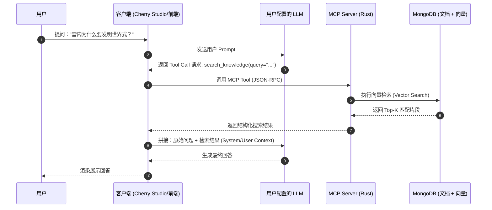
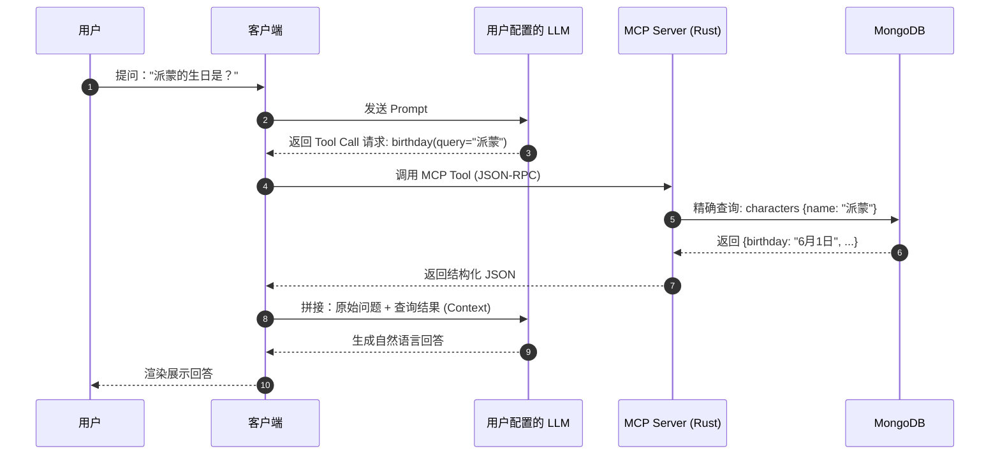
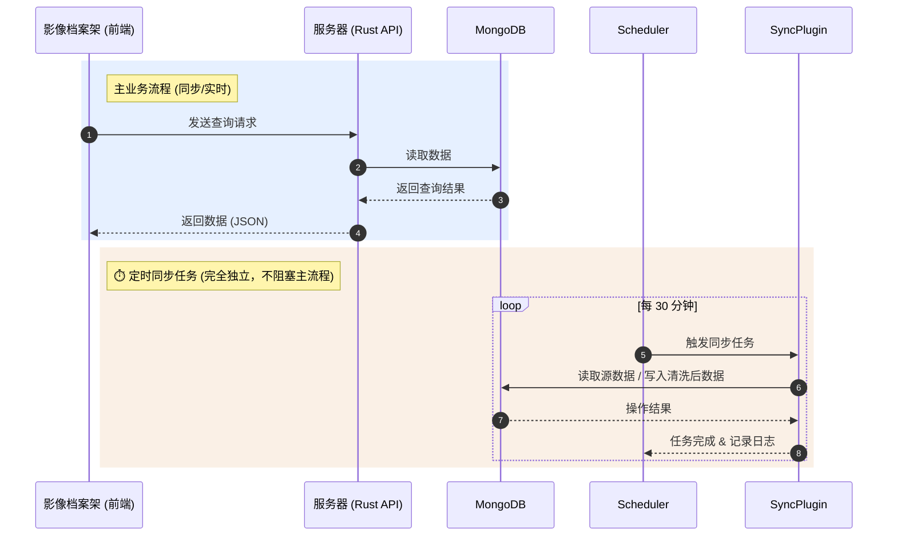
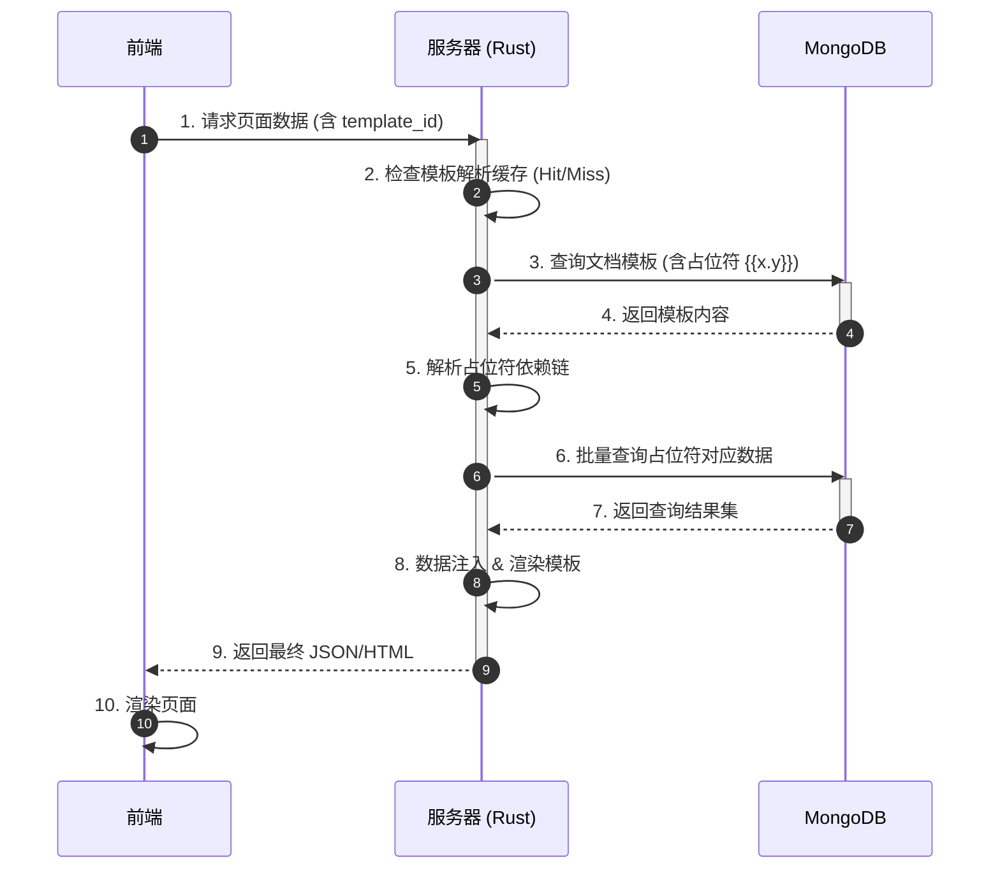
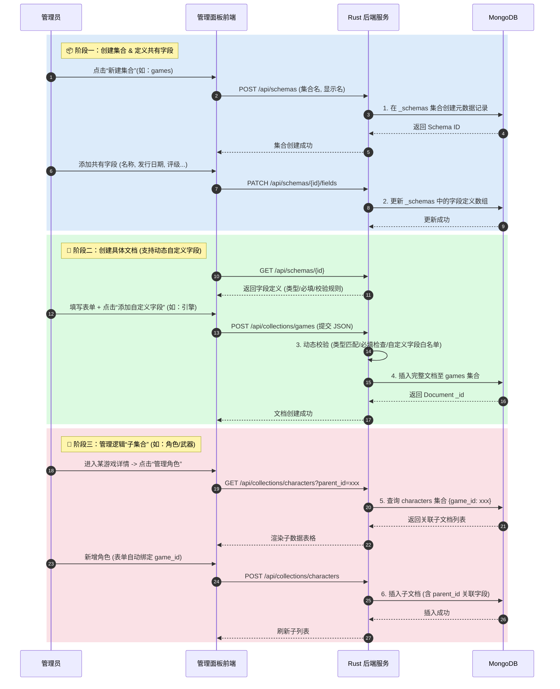

### MCP + 向量检索 (RAG)

```mermaid
sequenceDiagram
    autonumber
    participant User as 用户
    participant Client as 客户端 (Cherry Studio/前端)
    participant LLM as 用户配置的 LLM
    participant MCPServer as MCP Server (Rust)
    participant Mongo as MongoDB (文档 + 向量)

    User->>Client: 提问："雷内为什么要发明世界式？"
    Client->>LLM: 发送用户 Prompt
    LLM-->>Client: 返回 Tool Call 请求: search_knowledge(query="...")
    Client->>MCPServer: 调用 MCP Tool (JSON-RPC)
    MCPServer->>Mongo: 执行向量检索 (Vector Search)
    Mongo-->>MCPServer: 返回 Top-K 匹配片段
    MCPServer-->>Client: 返回结构化搜索结果
    Client->>LLM: 拼接：原始问题 + 检索结果 (System/User Context)
    LLM-->>Client: 生成最终回答
    Client-->>User: 渲染展示回答
```

### MCP + 结构化数据查询

```mermaid
sequenceDiagram
    autonumber
    participant User as 用户
    participant Client as 客户端
    participant LLM as 用户配置的 LLM
    participant MCPServer as MCP Server (Rust)
    participant Mongo as MongoDB

    User->>Client: 提问："派蒙的生日是？"
    Client->>LLM: 发送 Prompt
    LLM-->>Client: 返回 Tool Call 请求: birthday(query="派蒙")
    Client->>MCPServer: 调用 MCP Tool (JSON-RPC)
    MCPServer->>Mongo: 精确查询: characters {name: "派蒙"}
    Mongo-->>MCPServer: 返回 {birthday: "6月1日", ...}
    MCPServer-->>Client: 返回结构化 JSON
    Client->>LLM: 拼接：原始问题 + 查询结果 (Context)
    LLM-->>Client: 生成自然语言回答
    Client-->>User: 渲染展示回答
```

### 定时任务

```mermaid
sequenceDiagram
    autonumber
    participant Client as 影像档案架 (前端)
    participant Server as 服务器 (Rust API)
    participant Mongo as MongoDB
    
    rect rgb(230, 240, 255)
        note right of Client: 主业务流程 (同步/实时)
        Client->>Server: 发送查询请求
        Server->>Mongo: 读取数据
        Mongo-->>Server: 返回查询结果
        Server-->>Client: 返回数据 (JSON)
    end

    rect rgb(250, 240, 230)
        note right of Client: ⏱️ 定时同步任务 (完全独立，不阻塞主流程)
        loop 每 30 分钟
            Scheduler->>SyncPlugin: 触发同步任务
            SyncPlugin->>Mongo: 读取源数据 / 写入清洗后数据
            Mongo-->>SyncPlugin: 操作结果
            SyncPlugin-->>Scheduler: 任务完成 & 记录日志
        end
    end
```

### 动态模板渲染

```mermaid
sequenceDiagram
    autonumber
    participant Frontend as 前端
    participant Server as 服务器 (Rust)
    participant Mongo as MongoDB

    Frontend->>Server: 1. 请求页面数据 (含 template_id)
    activate Server
    Server->>Server: 2. 检查模板解析缓存 (Hit/Miss)
    Server->>Mongo: 3. 查询文档模板 (含占位符 {{x.y}})
    activate Mongo
    Mongo-->>Server: 4. 返回模板内容
    deactivate Mongo
    
    Server->>Server: 5. 解析占位符依赖链
    Server->>Mongo: 6. 批量查询占位符对应数据
    activate Mongo
    Mongo-->>Server: 7. 返回查询结果集
    deactivate Mongo
    
    Server->>Server: 8. 数据注入 & 渲染模板
    Server-->>Frontend: 9. 返回最终 JSON/HTML
    deactivate Server
    Frontend->>Frontend: 10. 渲染页面
```

### 管理面板

```mermaid
sequenceDiagram
    autonumber
    participant Admin as 管理员
    participant WebPanel as 管理面板前端
    participant RustBackend as Rust 后端服务
    participant Mongo as MongoDB

    rect rgb(220, 235, 250)
    note right of Admin: 📦 阶段一：创建集合 & 定义共有字段
        Admin->>WebPanel: 点击“新建集合”(如：games)
        WebPanel->>RustBackend: POST /api/schemas (集合名, 显示名)
        RustBackend->>Mongo: 1. 在 _schemas 集合创建元数据记录
        Mongo-->>RustBackend: 返回 Schema ID
        RustBackend-->>WebPanel: 集合创建成功
        
        Admin->>WebPanel: 添加共有字段 (名称, 发行日期, 评级...)
        WebPanel->>RustBackend: PATCH /api/schemas/{id}/fields
        RustBackend->>Mongo: 2. 更新 _schemas 中的字段定义数组
        Mongo-->>RustBackend: 更新成功
    end

    rect rgb(220, 250, 225)
    note right of Admin: 📝 阶段二：创建具体文档 (支持动态自定义字段)
        WebPanel->>RustBackend: GET /api/schemas/{id}
        RustBackend-->>WebPanel: 返回字段定义 (类型/必填/校验规则)
        
        Admin->>WebPanel: 填写表单 + 点击“添加自定义字段” (如：引擎)
        WebPanel->>RustBackend: POST /api/collections/games (提交 JSON)
        
        RustBackend->>RustBackend: 3. 动态校验 (类型匹配/必填检查/自定义字段白名单)
        RustBackend->>Mongo: 4. 插入完整文档至 games 集合
        Mongo-->>RustBackend: 返回 Document _id
        RustBackend-->>WebPanel: 文档创建成功
    end

    rect rgb(250, 225, 230)
    note right of Admin: 🔗 阶段三：管理逻辑“子集合” (如：角色/武器)
        Admin->>WebPanel: 进入某游戏详情 -> 点击“管理角色”
        WebPanel->>RustBackend: GET /api/collections/characters?parent_id=xxx
        RustBackend->>Mongo: 5. 查询 characters 集合 {game_id: xxx}
        Mongo-->>RustBackend: 返回关联子文档列表
        RustBackend-->>WebPanel: 渲染子数据表格
        
        Admin->>WebPanel: 新增角色 (表单自动绑定 game_id)
        WebPanel->>RustBackend: POST /api/collections/characters
        RustBackend->>Mongo: 6. 插入子文档 (含 parent_id 关联字段)
        Mongo-->>RustBackend: 插入成功
        RustBackend-->>WebPanel: 刷新子列表
    end
```
